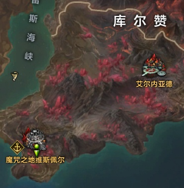
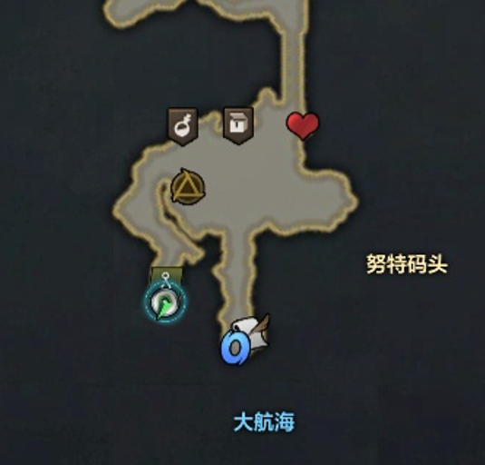

# LostArk-Auto-Fishing

## Installation

`conda` virtual environment is recommended.

```bash
conda create -n LostArk python=3.12
conda activate LostArk
pip install -r requirements.txt
```

## Location




## AutoFishing

```bash
python main.py
```
